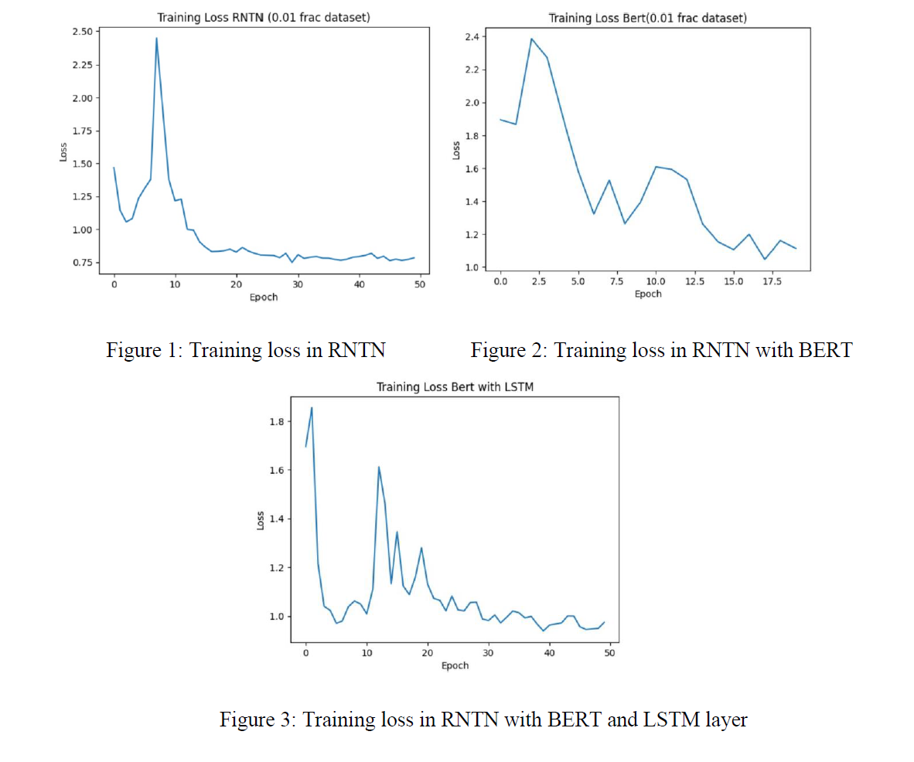

# Recursive Neural Tensor Network (RNTN) with BERT and LSTM

## Overview

This project aims to reproduce and extend the work presented in the paper titled "Recursive Deep Models for Semantic Compositionality Over a Sentiment Treebank" by Richard Socher et al. Our primary focus is to explore fine-grained sentiment analysis at the phrase level using Recursive Neural Tensor Networks (RNTNs). Additionally, we investigate the impact of integrating BERT and LSTM into the RNTN model.

## Project Team

- Runze Wang 
- Chen Tang 
- Marwa Khaleefa 

## Motivation

The original paper introduced a groundbreaking approach for handling semantic compositionality in sentiment analysis using RNTNs. We chose this paper due to its significant contributions to the field of Natural Language Processing (NLP) and its innovative methodology for analyzing sentiment at a more granular level.

## Implementation Details

### Traditional RNTN Model

The traditional RNTN model uses tensor and matrix multiplications to handle the recursive structure of trees. Our PyTorch implementation achieved an accuracy of 69.02%.

### RNTN with BERT and LSTM

To enhance the traditional RNTN model, we integrated BERT for its sophisticated pre-trained representations and added an LSTM layer to address the vanishing gradient issue. Despite our efforts, the accuracy achieved was 68.24%.

## Training Cost Comparison

The cost of training the models on an A100 GPU on Google Colab is as follows:

- Traditional RNTN: **$7**
- RNTN with BERT and LSTM: **$82**

## Accuracy Comparison

The accuracy of the models is summarized below:

- Traditional RNTN: **69.02%**
- RNTN with BERT and LSTM: **68.24%**

## Training Loss Comparison

The training loss fluctuates more with BERT and LSTM models due to their higher dimensionality compared to the traditional RNTN method. As shown in the image, the RNTN converges faster, indicating a more straightforward path to the local minimum. The higher dimensionality of BERT and LSTM models makes finding the local minimum more challenging.

## Reflection on Outcomes

Our reproduction attempts highlighted several challenges, including issues with vanishing gradients, overfitting, and model tuning. The integration of BERT did not yield the expected performance improvements, suggesting that pre-trained models may require significant customization for specific tasks like fine-grained sentiment analysis.

## Conclusion

This project provided deep insights into the challenges of reproducing research results and the nuances of model tuning and framework selection in deep learning projects. Despite the setbacks, the experience was immensely educational and highlighted the importance of rigorous testing and customization in model development.

## Reference
- https://github.com/mindspore-courses/DeepNLP-models-MindSpore
- https://github.com/stanfordnlp/CoreNLP
